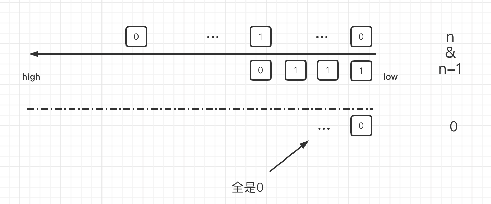

[Link: leetcode 231](https://leetcode.com/problems/power-of-two/)

Given an integer n, return true if it is a power of two. Otherwise, return false.

An integer n is a power of two, if there exists an integer x such that n == 2x.

# 经典位运算

## 1.暴力AC
根据题意，最小的值是1。值一直能被2整除，才表示其是2的幂，循环除判断true/false。
***
时间复杂度：O($\sqrt[2]{n}$)

空间复杂度：O(1)
```
func isPowerOfTwo(n int) bool {
    //* Given an integer n, explains that min Val is 1
    if n<1 {
        return false
    }
    // loop: conventional divided by 2 
    for n!=1{
        if n%2!=0{
            return false
        }
        n=n/2
    }
    
    return true
}
```
***

## 2.位运算
时间复杂度O(1)

空间复杂度O(1)

```
func isPowerOfTwo(n int) bool {
    return n>0 && n&(n-1)==0
}
```

因为二进制位是以2的幂级计算数值的，所以n的二进制位很好的能表达2的幂这个问题。
特征就是：如果位上只有一个1，其余都是0，那么其是也只能是2的幂

**所以n & (n-1) == 0是一个很好检测位上只有一个1的手段，也是n是2的幂的方法。**

### 2的幂解



