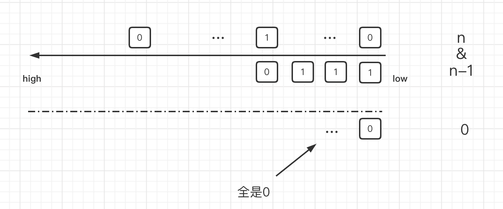

[Link:Leetcode 342](https://leetcode.cn/problems/power-of-four/)

Given an integer n, return true if it is a power of four. Otherwise, return false.

An integer n is a power of four, if there exists an integer x such that n == 4x.

# 经典位运算

## 1. 暴力AC
根据题意，判断给定的值是不是4的幂。最直观的方法，自然是不断的累乘，如果累积的乘等于n,那么n是4的幂；当大于n,那么n肯定不是4的幂；那小于n时,没有办法判断n,就继续累积。

---
时间复杂度：O($\sqrt[4]{n}$)

空间复杂度：O(1)

```
func isPowerOfFour(n int) bool {
    base:=1
    const x = 4
    for base < n{
        base = base * x
    }

    if base == n{
        return true
    }

    return false
}
```

---

## 位运算

时间复杂度 O(1)

空间复杂度 O(1)
```
func isPowerOfFour(n int) bool {
    if n < 1 || n&(n-1) != 0{
        return false
    } 
    
    //真是个有趣的trick,所以平时要头脑风暴
    if n & 0Xaaaaaaaa != 0{
        return false
    }
    return true
}

```
**4的幂肯定是2的幂**
4的幂是在2的幂基础上有间隔的`010101`,所以0xaaaaaaaa是`0x10101010101010101010101010101010`。这样就像锯齿鲨一样搅合在一起了。



