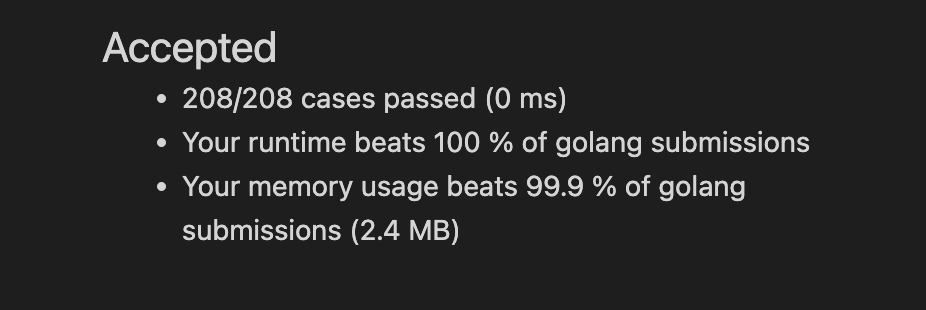

[Link: Leetcode 21](https://leetcode.cn/problems/merge-two-sorted-lists/)

You are given the heads of two sorted linked lists list1 and list2.

Merge the two lists in a one sorted list. The list should be made by splicing together the nodes of the first two lists.

Return the head of the merged linked list.


### 注意！！！
>The number of nodes in both lists is in the range [0, 50].\
-100 <= Node.val <= 100\
Both list1 and list2 are sorted in non-decreasing order.


链表题无非是迭代和递归的方法，玩转迭代和递归是解决链表这些题的好办法。

## 迭代套路

拟一个节点头，因为题目说明链表都是非递减次序的，所以不断比较多链表的节点大小，直到只剩一个链表。

为什么剩一个链表需要单独解决，因为没有对照实验了，只需要自己不断‘迭代’或者‘递归’到尾部。**因为这里是迭代套路，所以就用迭代法。**

---
时间复杂度： O(len(list1)+len(list2))

空间复杂度： O(1)

```
/**
 * Definition for singly-linked list.
 * type ListNode struct {
 *     Val int
 *     Next *ListNode
 * }
 */
func mergeTwoLists(list1 *ListNode, list2 *ListNode) *ListNode {
    //link list need make a prefix-node 
	dummy := new(ListNode)
	prev := dummy
	for list1 != nil && list2 != nil {
		/*comparing list1 with list2 when having two link list
		*
		* because question says list1 and list2 are in order by increasing
		 */
		if list1.Val <= list2.Val {
			prev.Next = list1
			list1 = list1.Next
		} else {
			prev.Next = list2
			list2 = list2.Next
		}

		prev = prev.Next

	}

	//eating single link list
	for list1 != nil {
		prev.Next = list1
		list1 = list1.Next
        prev = prev.Next
	}

	for list2 != nil {
		prev.Next = list2
		list2 = list2.Next
        prev = prev.Next
	}

	return dummy.Next
}
```
## 迭代法AC result
